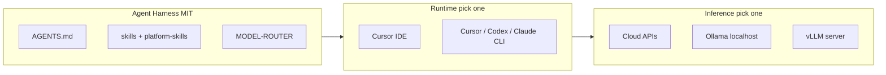

# Local models + CLI harness

> _Last updated: 2026-09-09_

Run the **same Agent Harness** (phase protocol, skills, ship gates) against local LLMs and headless CLIs — not a separate product.

## Architecture



## When to use local models

| Use local (Ollama / vLLM) | Stay on cloud |
|---------------------------|---------------|
| Wide grep synthesis, draft JSON, explore subagents | Schema migrations, customer copy, ship gates |
| Air-gapped or NDA repos | Adversarial verifier loops |
| Overnight batch classify | MCP-heavy web/pipeline edits |
| Cost cap on fan-out | Production promote |

**Rule:** Local for **volume and drafts**; cloud S-tier for **merge-ready** work (`docs/models/MODEL-ROUTER.md`).

## CLI harness matrix

| CLI | Harness install | Native subagents |
|-----|-----------------|------------------|
| Cursor Agent CLI | `install.ps1 -Ide cursor` | `.cursor/agents/` |
| OpenAI Codex CLI | `install.ps1 -Ide codex` | `.codex/agents/` |
| Claude Code | `install.ps1 -Ide claude-code` | delegate briefs |
| Gemini CLI | `install.ps1 -Ide gemini-cli` | delegate briefs |

Live matrix: https://klarix.ai/harness/ides · CLI + local hub: https://klarix.ai/harness/local-models

## Platform skills

| Skill | ROI | Role |
|-------|:---:|------|
| `agent-cli` | S | Headless CLI workflow |
| `ollama` | S | Desktop local models |
| `vllm` | A | GPU server inference |
| `langgraph` | A | Multi-step agent graphs |

Catalog: [`platform-skills/index.yaml`](../../platform-skills/index.yaml)

## Quick start (Ollama + Codex CLI)

```powershell
# 1. Ollama
ollama pull qwen2.5-coder:7b

# 2. Harness
git clone https://github.com/michael-baylard/agent-harness
cd agent-harness
pwsh -File install.ps1 -Ide codex -Persona indie-dev

# 3. Point Codex/OpenAI client at Ollama (when supported)
# OPENAI_BASE_URL=http://localhost:11434/v1
```

## VRAM guide (desktop)

| GPU | Practical local coding model |
|-----|------------------------------|
| 8 GB | 7–8B Q4 (qwen2.5-coder:7b) |
| 12 GB | 13B Q4 or 8B Q8 |
| 24 GB+ | 32B Q4 or vLLM multi-tenant |

Klarix pipeline scoring stays cloud API — local GPU optional (`ml` group in dev-env).

## Do not

- Skip `ship-check` because the model is local
- Embed HF weights in git
- Use local models for Harness Pro customer deliverable body text
